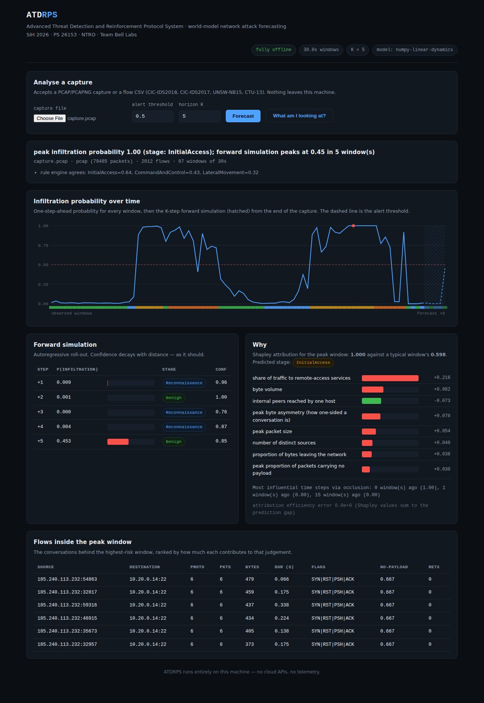

# ATDRPS — Advanced Threat Detection and Reinforcement Protocol System

**A world model for network attack forecasting.**

| | |
|---|---|
| Event | Smart India Hackathon 2026 |
| Problem Statement | **26153** — AI-based Network Attack Forecasting from Network Traffic Data |
| Organisation | National Technical Research Organisation (NTRO) |
| Theme / Category | Blockchain & Cybersecurity / Software |
| Team | Bell Labs — Lloyd Institute of Engineering & Technology |
| Idea | PreCog-NetDefense — a predictive world model for network intrusion |



---

## What this is

A conventional IDS answers **"is this flow malicious?"** — one flow at a time, with the
temporal and causal structure thrown away.

ATDRPS answers a different question: **"where is this network heading?"**

It learns the transition dynamics of network state,

> **P(S<sub>t+1</sub> | S<sub>≤t</sub>)**

then rolls that model forward **K steps** from the current traffic snapshot to produce:

1. an **infiltration probability timeline** over the next K windows,
2. the **predicted MITRE ATT&CK stage** — Reconnaissance → Initial Access → Lateral Movement → Command & Control → Exfiltration, plus Impact for denial of service and ransomware,
3. the **driving features** behind every prediction (SHAP values and attention weights) — never a black box.

A slow port scan that stays under every per-flow threshold, or a brute force that resolves
into lateral movement, is invisible flow-by-flow but plainly visible as a *trajectory*.
That trajectory is what ATDRPS models.

## Results

> **Read this first.** The table below is the v1 window-level benchmark on *synthetic*
> captures. An audit showed it largely measures detecting an attack that is already under
> way (copying the current label forward scores F1 0.898), and a real benign laptop capture
> pushed the v1 model to near-saturated attack scores. It is kept for history only.
> The honest, current evaluation (quiet-state onset forecasting, real background traffic,
> confidence intervals, false-alarm accounting) is in
> [`docs/RESEARCH_AND_PLAN_V2.md`](docs/RESEARCH_AND_PLAN_V2.md): forecasting an onset from
> silence is not achieved; forecasting escalation once early activity is visible flags about
> half to three quarters of simulated escalations ~2.5 min ahead at 1-4 false alerts/hour
> (15 test events, one background network, simulated attacks) -- a triage aid, not field-ready.
> To try it on your own network: `atdrps train-local --benign normal.pcap`, then
> `atdrps forecast capture.pcap` (see the notes on benign-data length in that document).


Held-out captures — train and test share no window, no flow and no campaign. Operating
thresholds are chosen on the validation split and applied unchanged to test.

| model | F1 | Precision | Recall | **FPR** | Stage acc. |
|---|---|---|---|---|---|
| logistic regression (static — the classifier the PS criticises) | 0.8477 | 0.8275 | 0.8688 | 0.1918 | 0.7619 |
| logistic regression (full context — a strong baseline) | 0.8946 | 0.9075 | 0.8821 | 0.0952 | 0.7956 |
| **ATDRPS world model** | **0.9294** | **0.9306** | **0.9283** | **0.0734** | **0.8400** |

The world model wins at **every** horizon step (step 5: F1 0.844 vs 0.815, FPR 0.236 vs
0.248), and it more than halves the false-positive rate of the static classifier the
problem statement criticises. At the class level it is strongest where it matters —
Command & Control F1 0.848, Exfiltration 0.858 — and weakest on `Impact`, F1 0.491 on 32
test windows, which is simply too rare a class in this corpus to learn well. That is
reported rather than hidden.

**Does it actually model dynamics?** Next-state error **0.611** against a persistence
floor of **1.007**. A model that beats a baseline on classification but cannot beat
"assume nothing changes" has learned a classifier, not a world model. This one clears the
floor.

Full tables, per-class scores and confusion matrices: [`docs/BENCHMARKS.md`](docs/BENCHMARKS.md).

### Two studies the headline table cannot answer

**Does dual-level fusion earn its cost?** Same split, same model, only the input
changes ([`docs/ABLATION.md`](docs/ABLATION.md)):

| input | F1 | FPR | Stage acc. |
|---|---|---|---|
| flow-derived only (80 dims — what a NetFlow export gives you) | 0.8952 | **0.0463** | 0.8375 |
| packet-derived only (23 dims) | 0.8661 | 0.1776 | 0.7738 |
| **both (103 dims, 16-window context)** | **0.9294** | 0.0734 | 0.8400 |
| both, no history (context = 1) | 0.8459 | 0.1892 | 0.7600 |

Fusion buys **+0.034 F1** over the better half and temporal context buys
**+0.084 F1** over the same features with no history — but flow-only has the
lower false-positive rate, so fusion is trading precision for recall rather
than dominating. That trade is stated in the report, not smoothed over.

**Does it survive an attack family it was never trained on?** Every capture
containing lateral movement was removed from training *and* validation
([`docs/HOLDOUT.md`](docs/HOLDOUT.md)). The alarm still fires on **29.6%** of
unseen lateral-movement windows at a **0.9%** benign false-alarm rate, ranking
them above background at AUC 0.729. That is partial transfer, not novel-attack
detection, and the stage head cannot name a class it never saw — reported as
the zero it is. A signature-based detector recovers none of an unseen family by
construction, which is the comparison worth making; it is not a claim that
ATDRPS detects unknown attacks in general.

## Design constraints we took seriously

* **Fully offline.** No cloud APIs, no telemetry, no runtime downloads. Critical
  Information Infrastructure is frequently air-gapped, so the tool has to work there.
* **Minimal dependency surface.** ATDRPS ships **its own pcap/pcapng parser** and **its own
  KernelSHAP implementation**. `scapy`, `pyshark` and `shap` are *not* required — one less
  supply-chain surface inside a defence network.
* **Explainable by construction.** Every prediction carries a ranked list of the flags,
  ports, timing statistics and payload patterns that produced it, in plain language.
* **Reproducible.** A run is defined by `(config, dataset, seed)`. The resolved config is
  written next to every checkpoint.
* **Honest evaluation.** Time-aware splits, thresholds never tuned on test, and a
  persistence floor reported alongside the headline numbers.

## Quick start

```bash
git clone https://github.com/nilanshpratapanand/26153-Advanced-Threat-Detection-And-Reenforcement-Protocol-System-ATDRPS-.git
cd 26153-Advanced-Threat-Detection-And-Reenforcement-Protocol-System-ATDRPS-

python -m venv .venv
source .venv/bin/activate          # Windows: .venv\Scripts\activate
pip install -r requirements.txt

python tests/run_tests.py          # standard-library runner (no pytest); PyTorch- and Chromium-backed tests skip when absent
```

PyTorch is needed only for the temporal transformer backend; everything else — ingestion,
windowing, the linear-dynamics backend, explainability, the dashboard — runs without it.

```bash
# CPU-only PyTorch
pip install torch --index-url https://download.pytorch.org/whl/cpu
```

### Five minutes, end to end

```bash
# 1. a labelled synthetic capture with a real kill chain in it
python -m atdrps.cli synth --out data/demo --seed 4242 --duration 2400 --campaigns 2

# 2. a training corpus (48 captures; ~9 minutes)
python -m atdrps.cli corpus --captures 48 --out data/corpus.npz

# 3. train every model and write the benchmark table
python -m atdrps.cli benchmark --corpus data/corpus.npz --split group

# 4. forecast from a capture, with explanations
#    (defaults to artifacts/model-linear; add --model artifacts/model-transformer
#    only if you installed PyTorch and trained it in step 3)
python -m atdrps.cli predict data/demo/capture.pcap

# 5. the offline dashboard
python -m atdrps.cli serve
#    -> http://127.0.0.1:8501

# 6. the two studies: dual-level ablation, and an attack family held out entirely
python -m atdrps.cli study ablation --corpus data/corpus.npz
python scripts/make_corpus.py --captures 40 --holdout-stage LateralMovement \
    --seed0 7000 --out data/corpus-holdout-lateral.npz
python -m atdrps.cli study holdout --corpus data/corpus-holdout-lateral.npz
```

### Using real datasets

```bash
# CIC-IDS2018 / CIC-IDS2017 / UNSW-NB15 / CTU-13 flow CSVs are auto-detected
python -m atdrps.cli predict Thursday-15-02-2018_TrafficForML_CICFlowMeter.csv

# raw PCAP is parsed in-tree -- no CICFlowMeter, no scapy
python -m atdrps.cli predict capture.pcap
```

A CSV-only run is reported as a **flow-level** run. Published CSVs are NetFlow-style
aggregates and carry almost none of the packet-level features, because that information
was discarded when the flows were built; `load_flow_csv` reports exactly which features it
could populate, so explainability can never name a packet-level driver on a run that never
saw a packet. Feed the matching PCAPs to get the full dual-level state.

## Which attacks does it actually catch?

All 18 attack families in the team's taxonomy are answered one by one in
[`docs/ATTACK_COVERAGE.md`](docs/ATTACK_COVERAGE.md) — including the ones ATDRPS
**cannot** see, because claiming those would be the fastest way to lose a reviewer.

| coverage | count | examples |
|---|---|---|
| **Full** — modelled as a stage, with generated training data | 9 | ransomware, worms, trojans, DoS/DDoS, DNS tunnelling, brute force, credential stuffing |
| **Partial** — visible through consequences, not the act | 6 | phishing, MitM, DNS spoofing, SQL injection |
| **Out of scope** — needs a different sensor | 3 | XSS, the zero-day exploit itself, session hijacking |

The zero-day row is the one worth pausing on. A signature-based IDS can never detect one.
A world model does not need to: it forecasts from the *trajectory*, and initial access by
an unknown exploit still produces lateral movement that looks like lateral movement.

## How it works

Five stages, described in full in [`docs/ARCHITECTURE.md`](docs/ARCHITECTURE.md):

1. **Ingest** — pcap/pcapng parsed in-tree (both endiannesses, nanosecond timestamps,
   VLAN, Linux SLL, IPv4/IPv6, TCP/UDP/ICMP), or a flow CSV mapped onto the canonical schema.
2. **Dual-level features** — NetFlow-style aggregates *plus* packet-level statistics
   (TTL variance, window trace, payload distribution, retransmissions, duplicate ACKs,
   fragmentation) that only a full capture can supply.
3. **State windowing** — 30-second windows become 103-dimensional state vectors: volume and
   shape, distributional aggregates, and behavioural detectors such as ports-swept-per-pair,
   beacon regularity and worm fan-out that only exist once traffic is grouped in time.
4. **World model** — a temporal transformer learns the state *change*, plus MITRE stage and
   infiltration heads, then forward-simulates K steps autoregressively.
5. **Explain** — grouped KernelSHAP for *what*, attention (or occlusion) for *when*, plus
   interpretable ATT&CK rules as corroboration.

## Repository layout

```
atdrps/
  config.py           resolved YAML configuration, dotted access, seeding
  cli.py              synth / corpus / train / benchmark / predict / serve
  data/
    schema.py         canonical packet, flow and state representations
    pcap.py           in-tree pcap/pcapng reader and writer
    synth.py          labelled synthetic attack-chain generator
    flows.py          5-tuple assembly and dual-level feature extraction
    datasets.py       CIC-IDS2018 / 2017, UNSW-NB15, CTU-13 adapters
    windows.py        time windowing -> 103-dim network states
    mitre.py          ATT&CK stage mapping and the interpretable rule engine
  models/
    base.py           the WorldModel interface and the shared K-step rollout
    transformer.py    temporal transformer (primary deliverable)
    numpy_dynamics.py ridge dynamics + logistic heads (dependency-free ablation)
    baseline.py       the mandated logistic-regression baseline
  train/              sequences, splits, training loops, metrics, benchmark
  explain/            KernelSHAP, attribution, plain-English glossary
  engine/             end-to-end inference
  live/               stdlib packet capture, port scan, live inference session (bonus,
                       beyond the PS's PCAP/CSV input requirement -- see below)
app/                  offline Flask dashboard
configs/              YAML configuration
docs/                 architecture, attack coverage, benchmarks, slides, demo script
tests/                350 tests, standard library runner
```

## Testing

```bash
python tests/run_tests.py            # everything
python tests/run_tests.py test_pcap  # one module
python tests/run_tests.py -v
```

The suite uses only `unittest`, so it runs unchanged inside an air-gapped network.
PyTorch-dependent tests skip cleanly when torch is absent; the tensor-shape logic of
multi-head attention is verified in *any* environment against attention computed the slow,
obvious way.

Several defects reached the benchmark before a test caught them, and the fixes are
recorded in the commit history rather than quietly folded in — including a window-labelling
off-by-one that leaked the answer into the input, and a split that left two positives in a
test set of 1,536.

## Datasets

| dataset | use | access |
|---|---|---|
| CSE-CIC-IDS2018 | primary; flow CSVs + raw PCAP | AWS Open Data / UNB |
| CIC-IDS2017 | cross-validation | UNB |
| UNSW-NB15 | cross-validation | UNSW Canberra |
| CTU-13 | botnet / C2 progression | Stratosphere IPS |
| built-in generator | development and CI; deterministic and labelled | `atdrps.cli synth` |

The built-in generator is development data and says so. Reported benchmark numbers come
from held-out captures; published-dataset numbers should be reproduced with the CSV/PCAP
adapters above.

## Licence

MIT — see [`LICENSE`](LICENSE).
